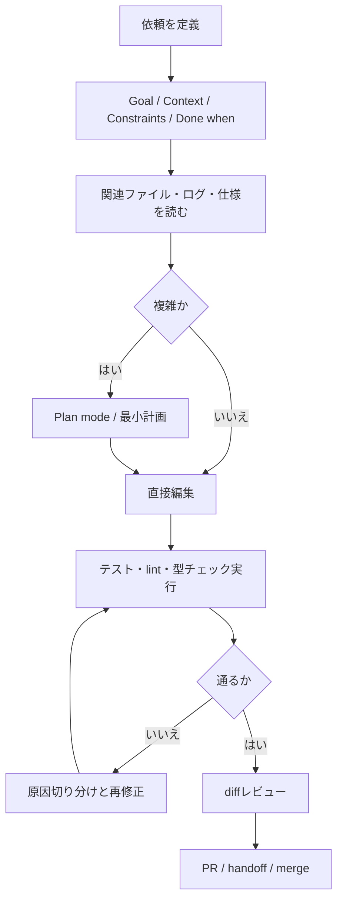

# Codexの能力を最大化する実践ガイド

## 要旨

Codex を最大限に活かすうえで、もっとも効くのは「魔法の一発プロンプト」ではなく、**ハーネス設計**です。OpenAI の公式ドキュメントとエンジニアリング記事は、Codex を単発の補助員ではなく、**継続的に設定し、検証し、改善するチームメイト**として扱うことを繰り返し勧めています。具体的には、タスクの目的・文脈・制約・完了条件を明示し、`AGENTS.md` に永続ルールを置き、テスト・lint・型チェック・差分レビューまでを「依頼の一部」に含める設計が最も再現性を高めます。OpenAI はこれを Codex CLI / IDE / App / Cloud の横断原則として示しており、実務記事でも「リポジトリ知識を system of record にする」「コードの正しさだけでなく、将来の agent 実行に対して可読であることを重視する」と述べています。 citeturn16view0turn17view0turn26view1turn32view0

最新の OpenAI API 系では、**短く、成果物中心のプロンプト**が基本です。GPT-5.5 の公式ガイドは、長い手順書型プロンプトよりも、期待成果・成功条件・制約・証拠ルール・出力形を先に定義する outcome-first prompting を推奨しています。加えて、現行世代では temperature より **`reasoning.effort`** と **`text.verbosity`** の調整が効きやすく、`medium` を起点に、簡単なタスクは `low`、難しい長時間タスクは `high` / `xhigh` に上げる、という考え方が公式に示されています。 citeturn19view6turn21view0

コード品質を実際に押し上げるのは、**ツールを使った閉ループ**です。Codex はローカルやクラウドでコードを読み、編集し、コマンドを実行でき、OpenAI の公式資料でも test harness・linters・type checkers を回しながら反復する使い方が前提化されています。さらに OpenAI Cookbook では、Review → Repair → Validate の反復ループや、Traces → Feedback → Evals → Codex handoff の改善フライホイールが推奨されています。これは研究面でも整合的で、Codex 論文は**反復サンプリング**が有効だと示し、ReAct・PAL/PoT・Reflexion は、推論を道具や実行環境に接続したときに性能が上がることを示しました。 citeturn32view0turn16view0turn34view2turn34view3turn4search0turn5search2turn5search11turn6search2turn6search3

最後に、**安全性と評価設計は性能の一部**です。Codex はデフォルトでネットワーク無効、サンドボックス境界、承認ポリシーという前提で動きます。クラウドでは setup と agent phase が分離され、インターネットを使うならドメイン許可リストや HTTP メソッド制限を使う設計が推奨されています。評価面では、関数レベルなら HumanEval / MBPP、実リポジトリ修正なら SWE-bench Verified、汚染耐性と広いコード能力なら LiveCodeBench、編集ワークフローなら Aider benchmark のように、**タスク形に合った benchmark を選ぶ**のが重要です。実運用では、これに自社の継続 eval、レビュー精度、CI 通過率、トークン消費・遅延を重ねて観測するのが王道です。 citeturn18view0turn18view2turn19view5turn29view1turn30view0turn29view4turn31view2turn29view2turn19view6

## 最大化の原則

Codex 活用の土台は、**コードベースを agent にとって“読める状態”にすること**です。OpenAI の Codex Best Practices は、良い結果を得る順序を「適切なタスク文脈 → `AGENTS.md` → 設定 → MCP → Skills → Automations」と整理しています。OpenAI の “Harness engineering” でも、リポジトリ知識を system of record にし、agent legibility を高めることが中心テーマになっています。つまり、Codex を賢くする最短経路は、モデルに工夫を押し込むより、**環境を明示化する**ことです。 citeturn16view0turn26view1

実務で最も効く依頼の骨格は、OpenAI が Codex 向けに推奨する **Goal / Context / Constraints / Done when** です。目的だけを書いて丸投げすると、Codex は広い探索を始めやすくなります。逆に、対象ファイル・関連ログ・エラー・設計制約・「どのテストが通れば完了か」を明記すると、探索範囲が絞られ、差分レビューもしやすくなります。これは current generation の GPT-5.5 outcome-first guidance とも一致しており、長い作業手順を固定するより「何ができれば成功か」を定義した方がよい、というのが公式方針です。 citeturn16view0turn19view6turn21view0

`AGENTS.md` は、Codex における**永続的なシステム文脈**です。Codex は作業前に `AGENTS.md` を読み込み、`~/.codex` のグローバル指示、リポジトリルート、現在ディレクトリまでを root-to-leaf で統合します。近い階層のファイルほど後勝ちになり、`AGENTS.override.md` も使えます。ここには repo layout、起動方法、build/test/lint コマンド、PR 期待値、禁止事項、done の定義を書くのが推奨されています。重要なのは、**短く正確に保つこと**で、繰り返し出る失敗だけをルール化するのがよい、と明示されています。 citeturn17view0turn16view0

設定も性能の一部です。Codex の品質問題の多くは、モデル能力よりも**作業ディレクトリの誤り、書き込み権限不足、間違ったデフォルトモデル、ツール未接続**などの setup 起因であると OpenAI は指摘しています。`config.toml` ではモデル、推論強度、sandbox、approval、MCP、profiles を固定でき、CLI・IDE・App はその設定レイヤーを共有します。再現性を出したいなら、まずここを整えるべきです。 citeturn16view0

Codex の強さは、**書くこと**よりも**確認までやらせること**で大きく伸びます。OpenAI は、変更だけで終わらせず、「必要ならテスト作成」「関連する test suite 実行」「lint / format / type check」「最終挙動確認」「diff review」まで依頼させるべきだとしています。クラウド版の紹介でも、Codex は terminal logs と test outputs の citation を通じて検証可能な証拠を返すとされており、これは hallucination 抑制にも直結します。 citeturn16view0turn32view0

並列性は強力ですが、使い所があります。Codex の subagent 文書は、read-heavy な探索・テスト・triage・要約は並列化の恩恵が大きい一方、write-heavy な並列編集は競合や調停コストが増えるため慎重に扱うべきだとしています。Codex App は worktree を内蔵し、複数 agent が同一 repo を安全に並行作業できるようにしています。したがって、**探索は並列、編集は単線または worktree 分離**が基本です。 citeturn18view5turn32view1

### 実務で最初に整える最低限

| 項目 | 何を用意するか | 期待効果 | 根拠 |
|---|---|---|---|
| 永続ルール | `AGENTS.md` に build/test/lint/禁止事項/done を記述 | セッションごとの再説明を削減し、再現性を上げる | citeturn17view0turn16view0 |
| 実行環境 | 正しい working directory、依存関係、MCP、sandbox | “モデルの失敗”に見える setup 事故を減らす | citeturn16view0 |
| 検証系 | unit/integration/e2e、lint、type check、formatter | hallucination を実行結果で潰せる | citeturn16view0turn32view0 |
| 差分レビュー | `/review`、PR review、code owners | agent 出力の重大欠陥を早期検出 | citeturn26view4turn15view0turn27search13 |
| 並列作業基盤 | worktrees / subagents | 探索速度を上げつつ、編集競合を抑える | citeturn18view5turn32view1 |

## プロンプト設計とパラメータ

OpenAI の現在のガイドラインを一言で言うと、**「短く、成果物に寄せ、継続ルールは外出しする」**です。Prompting ガイドでは、全体的な役割やトーンは system / developer message に置き、タスク固有の文脈や例は user message に寄せることが勧められています。Prompt engineering ガイドでは、developer message を `Identity → Instructions → Examples → Context` の順で組み、few-shot 例も developer message に置くのが基本形とされています。 citeturn19view1turn20view0

一方で、**Codex プロダクト文脈では `AGENTS.md` が durable guidance の本丸**です。毎回の依頼に repo ルールを焼き込むのではなく、永続ルールは `AGENTS.md`、今回だけの目的・差分対象・受け入れ条件だけをプロンプトに書くのが最も管理しやすいです。OpenAI も、同じ失敗を二度したら retrospective を取り、`AGENTS.md` を更新せよ、と明確に勧めています。 citeturn16view0turn17view0

**現行世代の第一選択は outcome-first prompt** です。GPT-5.5 ガイドは、期待成果、成功条件、制約、使える証拠、最終出力に何を含めるかを書き、解法の選択はモデルに任せる方がよいとしています。出力 schema は可能ならプロンプトに生書きせず、Structured Outputs を使う。静的部分は先頭、動的部分は末尾に置いて prompt caching を効かせる。この組み方はコーディング用途でもそのまま有効です。 citeturn19view6turn21view0turn20view0

ただし、**モデルやハーネスの種類によって“計画の出し方”は変わります**。Codex の Best Practices では、複雑タスクでは Plan mode や `PLANS.md` を使って最初に計画させるのが有効だとされています。これに対して API 直結の `gpt-5.3-codex` prompting guide では、ロールアウト中に前置きの plan や preamble を毎回強要すると途中停止を誘発しうるため、むしろ避けるよう勧めています。さらに `phase` を正しく保持しないと性能が大きく落ちるとも明記されています。要するに、**製品内の Plan mode は有効だが、API ハーネスで“見せる計画”を過剰に強制するのは別問題**です。 citeturn16view0turn23view2turn23view3turn22view2

パラメータ設計では、まず `reasoning.effort` を主軸に考えるべきです。OpenAI は `medium` をバランスのよい既定値、`low` を高速で十分な推論が欲しいケース、`high` / `xhigh` を難問・長時間エージェント作業向けとして位置づけています。しかも「高いほどよい」とは限らず、曖昧な指示や開放的なツール環境では overthinking や無駄な探索を増やしうると明記しています。Codex の Best Practices も同じで、簡単な変更は low、複雑な修正や debugging は medium/high、長時間の reasoning-heavy task は extra high と整理しています。 citeturn19view6turn16view0turn23view2

`text.verbosity` は、コード系タスクでかなり重要です。GPT-5.5 は簡潔で直接的な出力が得意なので、レビュー、バグ修正、リファクタなどでは `low` から始めるのが扱いやすいです。長い説明そのものは性能ではなく**最終回答の長さ**を変えるだけなので、思考の質を上げたいときは verbosity ではなく reasoning effort を調整します。 citeturn19view6turn21view0

temperature が露出している系では、**保守・修正・レビューは低め**が基本です。OpenAI API は、temperature を低くすると出力が集中・決定的になり、高くするとランダム性が上がると説明しており、`top_p` と同時に大きくいじることは推奨していません。他方、Codex 論文は repeated sampling が極めて有効だと示しており、HumanEval で pass@1 より best-of-many が大きく伸びました。したがって、実務では「単発の正確さが重要な refactor/review/debug は低 temperature」「候補を複数出して unit test で選べる生成タスクは modest sampling + best-of-N」が合理的です。 citeturn7search1turn7search4turn4search0turn30view0

few-shot は今でも有効ですが、**“短く、代表的で、developer message に置く”**のが現代形です。Prompt engineering ガイドは、few-shot 例は developer message に置き、多様な入力と望ましい出力を見せることを勧めています。Prompting ガイドは、例は YAML 風や箇条書きで簡潔にまとめる方が管理しやすいとしています。コードスタイル強制、レビュー出力形式、エラーメッセージ要約、ドキュメント整形など、**出力の型が固定されるタスク**ほど few-shot が効きます。 citeturn20view0turn20view2turn19view1

「chain-of-thought をどう使うか」については、研究と製品運用を分けて考えるのが重要です。研究では、CoT、Least-to-Most、Self-Consistency、ReAct、PAL/PoT、Reflexion がそれぞれ有効性を示しています。特に ReAct は外部情報や環境へのアクセスと推論を交互に回すことで hallucination を減らし、PAL/PoT は計算や検証をインタプリタに逃がすことで精度を上げます。Reflexion は、フィードバックを次試行に言語的に持ち越すことで HumanEval pass@1 を改善しました。現代の Codex 実務では、これらを「長い思考を見せる」よりも、**plan tool・テスト・validator・subagent・再試行ループに埋め込む**方が有効です。 citeturn5search0turn6search0turn5search1turn5search2turn5search11turn6search3turn6search2turn34view2

### 使い分けるべきプロンプトパターン

| パターン | 向いている場面 | 推奨の書き方 | 期待効果 | 主な注意点 | 根拠 |
|---|---|---|---|---|---|
| Outcome-first | 現行 GPT-5.5 / Codex の通常業務全般 | 期待成果・成功条件・制約・証拠・出力形を先に書く | 冗長な手順によるノイズを減らす | 手順が重要な業務では不足しうる | citeturn19view6turn21view0 |
| Goal / Context / Constraints / Done when | リポジトリ内の実装・修正 | 目的、対象ファイル、制約、完了条件を明記 | 探索範囲が安定し、レビューしやすい | 文脈不足だと広く読み始める | citeturn16view0 |
| Few-shot developer block | 書式固定、レビュー様式、コードスタイル強制 | Identity / Instructions / Examples / Context | 形式ぶれを減らす | 例が長すぎると文脈を圧迫 | citeturn20view0turn19view1 |
| Persistence + tool-use reminder | 自作 agent harness、汎用 API agent | 「解決するまで続ける」「不明ならツールで調べる」 | 途中停止と推測回答を減らす | 強すぎる eagerness は無駄探索を招く | citeturn23view1 |
| ReAct 型 | デバッグ、外部ログ・仕様・Web・MCP を使う調査 | 推論↔行動↔観測の反復を前提化 | hallucination を抑えて事実で進む | ツール境界が曖昧だと迷走しやすい | citeturn5search2turn19view7 |
| PAL / PoT 型 | アルゴリズム、数式、変換器、テスト可能な生成 | “考える”より executable artefact を作らせる | 計算・検証の外部化で精度向上 | 実行環境の安全性が必須 | citeturn5search11turn6search3 |
| Self-consistency / best-of-N | 単関数生成や候補選別がしやすい課題 | 複数候補を生成し unit test で選別 | pass@k を押し上げやすい | コスト増、評価ハーネス必須 | citeturn4search0turn5search1turn30view0 |
| Iterative repair loop | validator がある長めの修復/保守 | Review → Repair → Validate を回す | 1 回で外す失敗を減らす | validator が弱いと誤収束する | citeturn34view2turn34view3 |

### そのまま使える system / developer message 雛形

以下の雛形は、OpenAI の prompt engineering / prompting / GPT-5.5 guidance / Codex Best Practices を実務向けに圧縮したものです。production では、永続ルールは `AGENTS.md` へ、今回だけの要件を user message へ寄せるのが基本です。 citeturn20view0turn19view1turn19view6turn16view0

```text
# Identity
あなたはソフトウェア開発チームの実務的なコーディングエージェントです。
目的は、要求を満たす最小で正確な変更を、安全に、検証可能な形で完了することです。

# Core rules
- 不明なファイル内容やコードベース構造は推測せず、必ずツールで確認する。
- 既存実装を再利用し、不要な新規抽象化を増やさない。
- 変更後は、関連テスト・lint・型チェックを実行し、結果を要約する。
- 失敗した場合は、原因を切り分けて再試行する。
- 最終回答では、変更点、検証結果、残るリスク、次の一手を簡潔に述べる。

# Output contract
最終回答には次を含める:
1. 何を変えたか
2. どのファイルを触ったか
3. どの検証を実行し、何が通ったか
4. 未解決事項またはリスク
```

### タスク別の短い依頼テンプレート

#### 実装

```text
目的:
CSV インポート時に空文字を null として扱うように変更したい。

文脈:
- 対象は backend/imports/ と backend/models/user.py
- 既存の変換ロジックと validator を優先して再利用
- バグ再現は tests/imports/test_user_import.py の failure を参照

制約:
- 既存 API 契約は変えない
- migration は追加しない
- 影響範囲を user import に限定

完了条件:
- 既存 failing test が通る
- import 関連テストと型チェックが通る
- 変更理由を diff ベースで短く説明できる
```

**期待される出力**は、計画の長文ではなく、実装結果・差分対象・実行した検証・残リスクの短いサマリです。current generation ではこの方が安定します。 citeturn19view6turn21view0turn16view0

#### デバッグ

```text
目的:
本番で散発している 500 の原因を切り分けて、まず再現可能な最小修正を出したい。

文脈:
- エラーは /api/v1/checkout
- 直近の stack trace と関連ログは docs/incidents/2026-05-checkout.md
- まず read-only で調査し、原因候補を 3 つ以内に絞ってから修正する

制約:
- 推測で修正しない
- 不足情報はテストかログで埋める
- 影響が大きい変更は避ける

完了条件:
- 原因仮説、再現方法、最小修正、回帰確認を提示
```

#### コードレビュー

```text
あなたは reviewer として振る舞う。
正しさ、性能、セキュリティ、保守性、DX に影響する事項だけを挙げる。
重大度順で、ファイルと行範囲つきで指摘する。
些末な指摘は避ける。
最後に「patch is correct / incorrect」と確信度を返す。
```

これは OpenAI Cookbook の Codex SDK code review prompt とほぼ同じ方向です。 citeturn25view0

## ツール運用とタスク別ワークフロー

Codex の能力は、**どのツールを、どの順序で、どこまで自律実行させるか**で決まります。OpenAI は Responses API の tool calling を 5 段階の会話フローとして定義しており、また GPT-5.5 では「ツール固有のガイダンスは system prompt ではなく tool description 側に多く置く」ことを推奨しています。つまり、ツールは“呼べる”だけでなく、**用途・入力・副作用・再試行安全性・典型エラーまで説明された設計**にするのが重要です。 citeturn19view7turn19view6

Codex / Codex CLI / Codex App の実践では、探索・編集・検証・レビューを一体化したループが基本です。Codex CLI はローカルリポジトリの inspection / editing / command execution に強く、`/review` で diff を読んで作業ツリーを汚さずにレビューできます。App は複数 agent、thread、worktree、diff コメントを前提に設計されており、Cloud は repo 接続済みの sandbox で並列タスクを動かせます。単発の code generation ツールというより、**IDE / terminal / cloud task / PR review をまたいだ運用面の設計が本体**です。 citeturn26view3turn26view4turn32view1turn32view2

Codex 向けのツール選択には、いくつか明確な作法があります。OpenAI の Codex prompting guide は、`rg` / `rg --files` のような高速検索を優先し、専用ツールがあるなら shell より専用ツールを優先すること、read/list/search は可能なら並列化すること、`apply_patch`・`shell`・`update_plan` のような標準ツール群に寄せることを推奨しています。また MCP は「外部にある、頻繁に変わる、コピー＆ペーストしたくない文脈」にだけつなぎ、最初から全部のツールを生やすなとも書かれています。 citeturn23view2turn23view4turn18view3turn16view0

この点は、現場の強い実務家の観察とも一致します。Simon Willison は、coding agent が働きやすいコードベース条件として、**十分な自動テスト**と、Web プロジェクトなら dev server の起動方法や Playwright / curl による**対話的な確認手段**を与えることを挙げています。Aider の benchmark harness も、LLM が生成したコードを人手なしに実行する危険性を前提に、Docker コンテナ内で回すことを強く勧めています。つまり、良い coding agent は単に editor を持つのではなく、**REPL・shell・ブラウザ・テスト・隔離実行環境**までひとまとまりで持つべきです。 citeturn9search11turn29view2

### 推奨ツールと統合先

| カテゴリ | 推奨 | 何に効くか | 導入の要点 | 根拠 |
|---|---|---|---|---|
| ローカル実装 | Codex CLI | inspect-edit-run の高速反復 | 正しい working dir と sandbox を最初に固定 | citeturn26view3turn16view0 |
| 並列作業 | Codex App / worktrees / subagents | 複数案の並行探索、競合回避 | 探索系だけ並列、書き込みは分離 | citeturn32view1turn18view5 |
| durable guidance | `AGENTS.md` | repo 規約・コマンド・done の固定 | root-to-leaf、短く正確に | citeturn17view0turn16view0 |
| 再利用ワークフロー | Skills | ログ調査、PR review、移行計画などの定型化 | 1 skill = 1 job を守る | citeturn18view4turn16view0 |
| 外部コンテキスト | MCP | docs、ログ、デプロイ履歴、Figma 等 | 本当に manual loop を消すものだけ接続 | citeturn18view3turn16view0 |
| 機械可読出力 | Structured Outputs | レビュー結果の JSON 化、CI 連携 | schema は prompt でなく出力形式へ | citeturn25view0turn19view6 |
| 検証 | unit/integration/e2e、lint、type check | hallucination 抑制と done 判定 | request の完了条件に組み込む | citeturn16view0turn32view0 |
| 隔離実行 | sandbox / Docker / isolated runner | untrusted code 実行の安全化 | generated code は本番ホストで直接実行しない | citeturn18view0turn18view1turn29view2turn30view0 |

### タスク別ワークフロー

以下のフローは、OpenAI の公式ワークフローと研究・実務知見を統合した「最も外しにくい標準形」です。特に、**生成だけで終わらず、必ず validator につなぐ**点が重要です。 citeturn16view0turn34view2turn19view5



**コード生成**では、仕様から実装へ飛ぶ前に、既存コードの再利用ポイントを読ませ、validator を先に示すのが重要です。単関数・小規模課題なら best-of-N + unit test 選別が効きますが、実 repo では無闇な多サンプルより、関連ファイルの読みに基づく単一候補の質を上げる方が得です。 citeturn4search0turn16view0turn30view2

**リファクタリング**では、完了条件を「機能不変」「テスト green」「diff が読める」の三点に寄せると安定します。Codex は `/review` や PR review との相性がよいため、変更前後で reviewer モードを入れる運用が効果的です。 citeturn26view4turn15view0

**コードレビュー**では、重大度の高い actionable findings だけを返すように絞るのがよいです。OpenAI の GitHub integration でも、Codex は P0/P1 中心にレビューコメントを投稿する設計です。ノイズの多い nit は、人間の trust を落とします。 citeturn15view0turn25view0

**デバッグ**では、ReAct 的に「ログ・stack trace・再現手順・テスト」を順に取りにいくパターンが強いです。修正の前に、再現ケースをテストに落としてから fix させると、後続の回帰検知が容易になります。 citeturn5search2turn16view0

**ドキュメント生成**では、レビュー・修復・検証の閉ループが特に効きます。OpenAI の iterative repair loop cookbook は、stale なサンプルや壊れた notebook を、structured findings と validator feedback を使って反復修正するワークフローを示しています。これはコードだけでなく、README、Runbook、Migration guide にもそのまま使えます。 citeturn34view2

**テスト生成**は、Codex に任せやすい仕事の一つです。Best Practices でも、変更を依頼するときに「必要ならテストを追加し、関連 test suite を走らせる」ことを明示せよと推奨されています。特に bug fix では、まず failing test を作らせる運用が最も事故が少ないです。 citeturn16view0

**ペアプログラミング**として使うなら、1 thread = 1 task を徹底し、分岐したら `/fork` や worktree を使います。Codex の session controls は、長い会話が context pollution / context rot を起こすことを前提に設計されています。Claude Code 系の知見ですが Simon Willison も、同様に“テスト可能で、実際に触れる”状態を保つのが agent との協働に効くと述べています。 citeturn16view0turn18view5turn9search11

## 安全性と幻覚抑制と評価

Codex を強く使うほど、**安全性は後付けではなく設計項目**になります。Codex はデフォルトでネットワーク無効、workspace を中心としたサンドボックス、承認ポリシー付きで動作します。クラウド環境では setup phase と agent phase が分離され、秘密情報は setup 中のみ利用されて agent 開始前に除去されます。ローカルでも app / CLI / IDE extension は OS レベルの sandbox を使います。つまり、「まず隔離し、必要に応じて緩める」が公式の基本姿勢です。 citeturn18view0turn18view1

インターネットを使うときは、広く開けるほど賢くなるわけではありません。OpenAI は、agent internet access のリスクとして prompt injection、コードや secrets の exfiltration、悪性依存の取得、ライセンス問題を列挙し、**必要なドメインと HTTP メソッドだけを許可**せよと明示しています。特に GET / HEAD / OPTIONS への制限、allowlist、work log のレビューは、そのまま採用すべきです。 citeturn18view2

hallucination を減らす最も実務的な方法は、**「知らなければ読む・走らせる・測る」**をルールにすることです。OpenAI の agentic workflow guidance は、「ファイル内容やコードベース構造に確信がなければツールで読め、推測するな」とかなり強い言い方で勧めています。Codex 製品側でも、変更後に tests / lint / type checks / diff review まで行うことを推奨しており、クラウド版では terminal logs と test outputs の citation を出せます。つまり、良い agent は答えを“考え出す”より、**証拠を集めて最小限の仮説を立てる**べきです。 citeturn23view1turn16view0turn32view0

コード生成・評価ハーネスの安全性も忘れてはいけません。HumanEval の公式 harness は、untrusted な model-generated code を robust security sandbox の外で実行しないよう強く警告し、実行呼び出しを意図的にコメントアウトしています。Aider benchmark harness も、LLM が `sudo rm -rf /` のような危険コードを出しうることを理由に Docker 実行を推奨しています。生成コードを評価する側こそ、最も厳密に隔離すべきです。 citeturn30view0turn29view2

評価指標は、**課題の形**に合わせて選ぶ必要があります。HumanEval は関数レベルの functional correctness と pass@k の標準で、OpenAI の公式 repo もその評価ハーネスです。MBPP は 974 件の entry-level Python 課題で、基本的な関数合成能力を見るのに向きます。SWE-bench は 12 個の人気 Python repo の現実の GitHub issue 2,294 件を使う repository-level benchmark で、hidden tests を用いて patch の妥当性を見ます。SWE-bench Verified はそのうち 500 件の human-validated subset で、問題文の明確性や test patch の正しさが確認された、より信頼性の高い評価です。LiveCodeBench は LeetCode / AtCoder / Codeforces 由来の継続収集問題を用いる contamination-free benchmark で、code generation だけでなく self-repair / code execution / test output prediction も見ます。Aider benchmark は、自然言語の依頼から既存ファイルを編集し、実際に unit tests を通す end-to-end 編集能力を測ります。 citeturn30view0turn29view4turn30view2turn29view1turn31view2turn29view2

### どの benchmark を何に使うか

| Benchmark | 何を測るか | 使いどころ | 見落としやすい点 | 根拠 |
|---|---|---|---|---|
| HumanEval | 関数単位の functional correctness、pass@k | 単関数生成、best-of-N 比較 | 実 repo 編集や長い文脈は測れない | citeturn4search0turn30view0 |
| MBPP | 基礎的な Python 問題 974 件 | 初歩的 code synthesis、few-shot 比較 | 実運用の複雑性は薄い | citeturn29view4 |
| SWE-bench | 実 repo / issue / patch 修正 | 実案件に近い修復能力 | 環境構築重い、元データの難しさ・曖昧さに注意 | citeturn30view2turn30view4 |
| SWE-bench Verified | human-validated 500 件 | 実務に近い agent 評価の第一候補 | full leaderboard と bash-only 比較を分けて見る | citeturn29view0turn29view1 |
| LiveCodeBench | contamination-free + self-repair / execution 等 | 最新モデル比較、広いコード能力 | contest 問題寄りで repo 修正とは別物 | citeturn31view2turn29view3 |
| Aider benchmark | 編集→保存→テスト通過の end-to-end | コード編集 agent の比較 | リポジトリ規模やドメイン差は別途見る | citeturn29view2turn28search5 |

OpenAI の eval best practices は、評価設計を **Objective → Dataset → Metrics → Compare → Continuously evaluate** の順で回すべきだと整理しています。さらに、LLM は open-ended generation よりも比較・分類・採点の方が安定するため、pairwise comparison や criteria-based scoring に寄せた eval の方が信頼できるとも述べています。これをコーディングに移すと、public benchmark の pass rate だけでなく、**CI green-on-first-pass、レビューコメントの precision、リグレッション検出率、token / latency / tool-call 数**のような内部メトリクスを継続的に追うのが望ましいです。後者は公式記事でも、精度・token consumption・end-to-end latency を benchmark せよ、traces と feedback から eval を増やせ、という形で推奨されています。 citeturn19view5turn19view6turn34view3

### 実務用の評価チェックリスト

- 依頼ごとに「正解」を言葉でなく**検証手順**に落とせているか。 citeturn19view5turn16view0
- 変更後に走らせるテスト・lint・型チェックが `AGENTS.md` に明記されているか。 citeturn17view0turn16view0
- “よかった出力”ではなく、“再発してほしくない失敗”が eval データに入っているか。 citeturn19view5turn34view3
- 評価が one-shot ではなく、継続的に回るか。 citeturn19view5
- review / repair / validate の閉ループがあるか。 citeturn34view2
- 長時間ワークフローでは traces と handoff が残るか。 citeturn34view3

## チーム統合と導入ロードマップ

チーム導入では、Codex を「個人の補助ツール」で終わらせず、**PR・CI・レビュー・デプロイの既存制度に埋め込む**のが成功パターンです。OpenAI の GitHub integration では、Codex は pull request の diff を読み、repo guidance に従って GitHub code review を投稿します。`@codex review` で起動でき、自動レビューも可能です。さらに `AGENTS.md` の `Review guidelines` を読み、ファイルに近いルールほど強く効くため、レビュー品質を repo ごとに揃えやすいです。 citeturn15view0turn17view0

CI への統合は、**structured outputs を前提にした machine-readable review / fix** が基本です。OpenAI Cookbook の Codex SDK 例では、GitHub Actions / GitLab / Azure DevOps / Jenkins で headless Codex を実行し、JSON schema に沿った findings を出させ、それを SCM API で inline comment として投稿しています。コードレビュー用途では read-only sandbox が推奨され、GitLab 例では API key を Codex 自身が読めないように権限を落とす戦略まで示されています。ここまでやると、Codex は “しゃべる bot” ではなく、**CI の一つの structured reviewer** になります。 citeturn25view0

マージゲートは、今まで以上に重要です。GitHub は protected branches で required reviews と required status checks を設定でき、code owners の必須承認も付けられます。日本語ドキュメントでも、`CODEOWNERS` によって PR 作成時に自動でレビュー依頼が飛ぶことが説明されています。AI が PR を増やすほど、**誰がどこを最終承認するか**をコード上で機械可読にしておく価値が上がります。 citeturn27search0turn8search3turn27search13

デプロイは、branch protection だけでは足りません。GitHub Environments には deployment protection rules があり、手動承認、遅延、対象ブランチ制限、GitHub App による外部保護ルールをかけられます。Codex で自動修正・自動レビューまで進めても、prod 直前では**人間承認または環境ルール**を残すのが妥当です。 citeturn27search7turn27search20

一方で、agent 時代は merge philosophy も変わります。OpenAI の harness engineering 記事は、agent throughput が高まると PR を短命にし、テストの flaky さは follow-up run で直すなど、従来の強い同期的ボトルネックが逆効果になる場面があると述べています。これは「レビューや gate をなくす」という意味ではなく、**小さく頻繁な変更 + 自動 gate + 高信号レビュー**に寄せる、ということです。 citeturn26view1turn15view0turn8search2

### 導入ロードマップ

#### 初週

まずは 1 リポジトリだけで始めます。`AGENTS.md` を作り、起動・テスト・lint・型チェック・PR 作法・禁止事項・done を書きます。Codex CLI か App を導入し、sandbox は厳しめの既定値のまま運用します。最初の用途は、**小さな bug fix・テスト追加・ドキュメント修正**に絞るのが安全です。 citeturn17view0turn16view0turn18view0

#### 最初の一か月

次に、1 つの安定ワークフローを Skill 化します。たとえば「CI failure triage」「PR review against checklist」「release note drafting」などです。同時に、最低限の eval を作ります。最初は public benchmark でなくてもよく、自社の頻出 failure を 20～50 件集めるだけで十分価値があります。必要なら traces とフィードバックから eval を増やす改善ループを回します。 citeturn18view4turn16view0turn19view5turn34view3

#### その次の一か月

CI / PR に統合します。Codex の structured review を GitHub Actions などで動かし、required status checks に追加します。`CODEOWNERS` と protected branches を整え、AI が出した PR でも human approval の責任境界が明確になるようにします。並列作業が増えたら worktrees を標準化します。 citeturn25view0turn8search3turn27search13turn32view1

#### その先

MCP でログ、仕様書、デプロイ履歴、インシデント情報をつなぎ、cloud / app / IDE を使い分けます。この段階では、individual prompt tuning よりも、**ハーネスの進化**が主要レバーになります。つまり、traces・evals・skills・review guidelines を継続更新する運用に移るべきです。 citeturn18view3turn34view3turn26view0


## 優先ソースと限界

### 優先して読むべきソース

| 優先度 | ソース | 何が得られるか | 参照 |
|---|---|---|---|
| 最優先 | OpenAI Codex Best Practices | Codex の標準運用原則の全体像 | citeturn16view0 |
| 最優先 | `AGENTS.md` ガイド | 永続指示の設計、階層優先順位、容量制限 | citeturn17view0 |
| 最優先 | Agent approvals & security / Sandbox / Internet access | 安全運用の基準線 | citeturn18view0turn18view1turn18view2 |
| 最優先 | GPT-5.5 / Prompt guidance | 最新 API 世代の prompt 設計と reasoning/verbosity | citeturn19view6turn21view0 |
| 最優先 | Prompt engineering / Prompting / Tools / Function calling | developer message、few-shot、tool descriptions の定石 | citeturn20view0turn19view1turn19view3turn19view7 |
| 高 | Codex 論文 + HumanEval repo | pass@k、repeated sampling、関数レベル評価 | citeturn4search0turn30view0 |
| 高 | SWE-bench / SWE-bench Verified | 実 repo 修復の benchmark 設計 | citeturn30view2turn29view0turn29view1turn30view4 |
| 高 | LiveCodeBench | contamination-free と自己修復/実行系評価 | citeturn31view2turn29view3 |
| 高 | Codex SDK code review cookbook | CI / SCM への structured integration | citeturn25view0 |
| 高 | Iterative repair / Agent improvement loop cookbooks | validators と traces を使った改善フライホイール | citeturn34view2turn34view3 |
| 補助 | Simon Willison の coding-agent tips | テスト可能なコードベースの作り方 | citeturn9search11 |
| 補助 | Aider benchmark harness | 編集系 benchmark と安全な実行環境の勘所 | citeturn29view2 |

### 開かれた論点と限界

本レポートの中核は、OpenAI 公式ドキュメント、OpenAI のエンジニアリング記事、原論文、公式 benchmark / repo を中心に構成しています。そのため信頼性は高い一方、**現場の個別 IDE やサードパーティ coding agent の細かな UX 差**までは扱っていません。また、OpenAI の最新 API 指針は GPT-5.5 と `gpt-5.3-codex` を中心に明文化されているため、旧世代 Codex や他社モデルにそのまま当てはめるとズレが出る可能性があります。さらに、日本語の一次情報は GitHub ドキュメント側に比重があり、Codex 自体の詳細ガイドは英語ソースが中心です。 citeturn19view6turn23view2turn27search13

総合すると、Codex を最大化する最短ルートは次の一文に尽きます。**「短い outcome-first 指示で仕事を定義し、永続ルールは `AGENTS.md` に置き、ツールで読んで、テストで確かめ、レビューと eval で継続改善する」**。これが、公式文書・原論文・ハーネス実装・実務家の知見を横断した、最も再現性の高い結論です。 citeturn16view0turn17view0turn19view6turn32view0turn19view5turn34view3